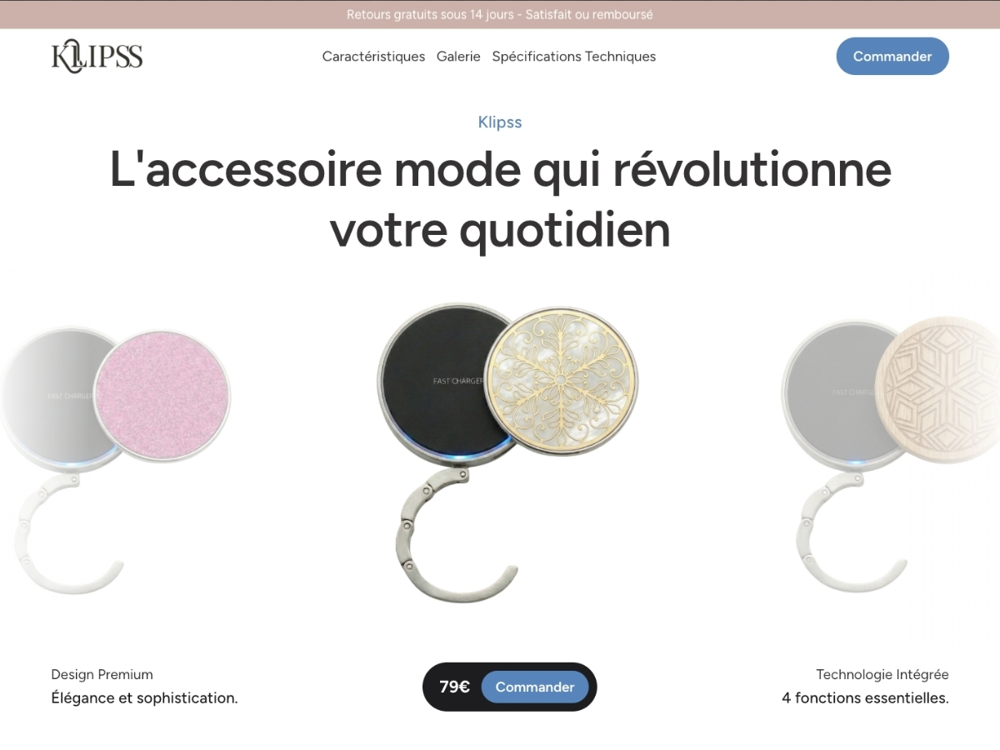

# Klipss — Thème WordPress Custom

Landing page e-commerce one-product pour Klipss, accroche-sac connecté 3-en-1.
Site en production : https://klipss.fr



## Stack technique
- WordPress (sans WooCommerce)
- Thème custom développé from scratch (PHP, CSS, JavaScript vanilla)
- Configurateur produit interactif (choix coloris, compatibilité Apple/Android)
- Intégration Stripe directe (Stripe.js + webhooks PHP) sans plugin
- Tunnel de pré-commande custom

## Choix techniques

### Pourquoi pas WooCommerce

Le site vend un seul produit en pré-commande, pas un catalogue. WooCommerce aurait ajouté ~50 tables en base et des centaines de hooks pour des fonctionnalités inutiles ici (gestion de stock multi-produits, taxes complexes, variations, coupons). Pour un tunnel mono-produit avec paiement Stripe, ~300 lignes de PHP custom suffisent et restent entièrement sous mon contrôle. Pas de surcouche à débugger, pas de dépendance à un plugin qui peut casser à chaque mise à jour. Côté front, ça évite aussi le poids mort des scripts WooCommerce chargés par défaut. Le client garde un back-office WordPress familier pour ses pages éditoriales (mentions légales, CGV) sans complexité e-commerce inutile.

### Pourquoi Stripe en intégration directe

J'ai intégré Stripe.js et les webhooks en PHP pur (dans `inc/klipss-customer.php`) plutôt que de passer par un plugin. Ça me donne la maîtrise complète du tunnel : je définis les étapes, les validations et l'UX du paiement sans hériter du flow imposé par un intermédiaire. Pas de couche d'abstraction entre mon code et l'API Stripe, le debug est direct et la doc Stripe s'applique telle quelle. Chaque événement webhook (`payment_intent.succeeded`, etc.) est traité explicitement. C'était aussi un choix d'apprentissage : j'ai voulu comprendre comment Stripe fonctionne réellement, pas juste configurer un plugin.

## Structure du thème

```
klipss-theme/
├── assets/
│   ├── css/
│   │   ├── main.css              # Styles principaux
│   │   └── main.min.css          # Version minifiée
│   ├── icons/                    # Icônes SVG (réseaux sociaux, play)
│   ├── images/
│   │   ├── klipss/               # Photos produit (6 coloris, desktop)
│   │   ├── slider-highlight/     # Images slider mise en avant
│   │   ├── testimonials/         # Photos témoignages
│   │   ├── details/              # Illustrations détails produit
│   │   ├── logo.svg              # Logo Klipss
│   │   └── favicon.*             # Favicons
│   ├── js/
│   │   ├── main.js               # Entry point ES6 modules
│   │   └── modules/
│   │       ├── navigation.js     # Menu mobile, scroll
│   │       ├── hero-slider.js    # Slider hero auto-scroll
│   │       ├── configurator.js   # Sélecteur coloris/options
│   │       ├── stripe-checkout.js # Paiement Stripe direct
│   │       ├── cart.js           # Logique panier (legacy)
│   │       ├── account.js        # Espace client
│   │       ├── sticky-bar.js     # Barre sticky CTA
│   │       ├── modals.js         # Modales
│   │       ├── sliders.js        # Sliders génériques
│   │       ├── faq.js            # Accordéon FAQ
│   │       ├── parallax.js       # Effets parallaxe
│   │       ├── animations.js     # Animations au scroll
│   │       └── video-section.js  # Autoplay vidéo
│   └── videos/
│       └── klipss-pub.mp4        # Vidéo promotionnelle
├── inc/
│   ├── nav.php                   # Header / navigation
│   ├── klipss-customer.php       # Commandes client, AJAX Stripe
│   └── klipss-admin-orders.php   # Gestion commandes admin
├── front-page.php                # Landing page principale
├── page-mon-compte.php           # Page espace client
├── page-conditions-generales-de-vente.php
├── page-conditions-generales-utilisation.php
├── page-mentions-legales.php
├── header.php                    # <head>, SEO, structured data
├── footer.php                    # Footer
├── functions.php                 # Enqueue scripts, AJAX, config
├── style.css                     # Métadonnées thème WordPress
├── screenshot.png                # Aperçu thème WP Admin
└── serve-image.php               # Proxy images (fix MIME Local)
```

## Installation

1. Cloner le repo dans `wp-content/themes/`
2. Activer le thème depuis l'admin WordPress
3. Définir les constantes suivantes dans `wp-config.php` :
   ```php
   define('KLIPSS_STRIPE_PK', 'pk_live_...');
   define('KLIPSS_STRIPE_SK', 'sk_live_...');
   define('KLIPSS_SHOP_EMAIL', 'contact@klipss.fr');
   ```

## Limites connues et ce que je referais

**Module cart.js en legacy.** J'avais initialement prévu un panier multi-articles persistant avant de pivoter vers un tunnel de pré-commande direct (un seul produit, paiement immédiat). Le fichier `assets/js/modules/cart.js` est conservé mais n'est plus appelé dans le flow actuel. Aujourd'hui je le supprimerais proprement, ou je le déplacerais dans un dossier `/archive` si je voulais garder une trace.

**Aucun test automatisé.** Projet client livré sous contrainte de temps, les tests n'ont pas été priorisés. Je mettrais au minimum des tests unitaires PHPUnit sur la logique de calcul de commande, et un test d'intégration sur le webhook Stripe avec un mock de l'API.

**Constantes Stripe en dur dans wp-config.php.** C'est la pratique courante WordPress, mais pas la meilleure. J'utiliserais `vlucas/phpdotenv` avec un fichier `.env` hors-repo, ce qui permettrait aussi de versionner un `.env.example` pour documenter les variables attendues.

**Pas de système de build.** Le JS utilise des modules ES6 natifs, le CSS est écrit à la main avec une version minifiée générée manuellement. Ça fonctionne ici parce que le projet est petit (~12 modules JS, un seul fichier CSS). Sur un projet plus gros, j'utiliserais Vite pour bundler, tree-shaker et minifier automatiquement.
